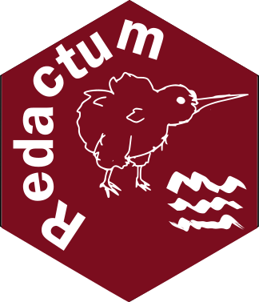

Redactum: Simplifying the writing of manuscripts in Spanish and other
languages.
================
Hugo Aguirre Villaseñor
10 marzo 2026

# Redactum <a href="https://github.com/Macrurido/Redactum/"></a>

<!-- # pkgname  -->

<!-- README.md is generated from README.Rmd. Please edit that file -->

Shield: [](http://creativecommons.org/licenses/by/4.0/)

Redactum © 2025 by Hugo Aguirre Villaseñor is licensed under a [Creative
Commons Attribution 4.0 International
License](http://creativecommons.org/licenses/by/4.0/).

[](http://creativecommons.org/licenses/by/4.0/)

## Redactum

This package offers tools to streamline the writing of manuscripts in
Spanish and in other languages, making it a versatile choice for all
your writing requirements.

## Installation

You can install the development version of Redactum from
[GitHub](https://github.com/Macrurido/Redactum.git) using one of the
following options:

Using the **pak** package

``` r
# install.packages("pak")
pak::pak("Macrurido/Redactum")
```

or using the **devtools** package

``` r
library(devtools)
install_github("Macrurido/Redactum")
```

``` r
library(Redactum)
```

The package includes functions specifically designed to aid writing in
Spanish, as well as functions that support writing in other languages.

# Functions designed to make writing in Spanish easier.

## fn_enlista

It is a function that inserts commas between the elements of a vector,
using ‘and’ for the last element unless the last word begins with ‘i’ or
‘I’, in which case it uses ‘e’. In the context of numerical vectors, the
letter ‘y’ is placed before the final word.

It returns A vector that inserts a comma after each element, adds *y* to
the last element, and if the last element is a word starting with *i*,
it instead adds *e*.

# Functions designed to facilitate writing in Spanish and other languages.

## n_cient

Abbreviated scientific name

The abbreviated name is derived from the scientific name. To create the
abbreviation, the first letter of the genus is taken, written in
uppercase, and followed by a period. The specific name is added after a
space in the scientific name.

Within the function, a condition is established. If the scientific name
refers to a species that is not specified under a particular genus, such
as Hydrolagus sp., or to multiple species within a genus, like
Hydrolagus spp., the name will not be abbreviated. However, if the
scientific name designates a specific species, it will be modified; for
instance, Hydrolagus melanophasma will be abbreviated to H.
melanophasma.

The function operates correctly with or without periods in
abbreviations, such as “sp” or “sp.”

# Citation

Aguirre-Villaseñor H (2026). Redactum: Redactum: Simplifying the writing
of manuscripts in Spanish and other languages. R package version 0.1.0,
<https://macrurido.github.io/Redactum/>.

    @Manual{,
      title = {Redactum: Redactum: Simplifying the writing of manuscripts in Spanish and other languages},
      author = {Hugo Aguirre-Villaseñor},
      year = {2026},
      note = {R package version 0.1.0},
      url = {https://macrurido.github.io/Redactum/},
    }

<p style="font-size:14pt; color:blue; text-align:justify;">

</p>
